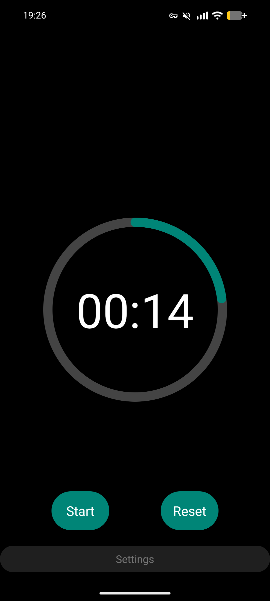

# Stopwatch with Productivity Timer ⏱️

An Android stopwatch app with productivity-focused features — set a custom time limit, watch your progress visually, and get reminders when you need them.

Built as part of the [Hyperskill Android Developer track](https://hyperskill.org/).

## Screenshots

## Features

- ⏱️ **Stopwatch** — start, pause, reset, with second-by-second updates
- 🎯 **Custom upper limit** — set your own time goal via the settings dialog
- 🔵 **Circular progress indicator** — visual fill that grows as time elapses
- 🚨 **Limit reached alert** — once your goal is hit, the timer turns red and pulses
- 🔔 **Friendly reminder** — animated bell icon when you've hit your target
- 🌙 **Dark mode** — full support, follows the system theme

## Tech Stack

- 🟣 **Kotlin**
- 🤖 **Android SDK** (minSdk 24, targetSdk 33)
- 🎨 **Material Components** — `CircularProgressIndicator`, `MaterialButton`
- ⏰ **Handler + postDelayed** — for the per-second tick logic
- 🪟 **AlertDialog** — custom layout for the settings screen
- 🎬 **Drawables** — vector icons, color selectors, custom shapes
- 🌗 **Day/Night theming** via `values/` and `values-night/` resources

## What I learned

- Activity lifecycle and how to handle background state correctly
- Null safety patterns in Kotlin (`?.`, `?:`, `!!`, smart casts)
- Working with anonymous objects to implement listener interfaces
- The Android drawable system (selectors, shapes, vectors, colors)
- Building reusable custom dialogs with their own layouts
- Why `(seconds * 100) / limit` ≠ `seconds / limit * 100` in integer math 😅

## How to run

1. Clone this repo
2. Open in Android Studio
3. Run on an emulator or device with API 24+

---

👤 [My Hyperskill profile](https://hyperskill.org/profile/627979498)
